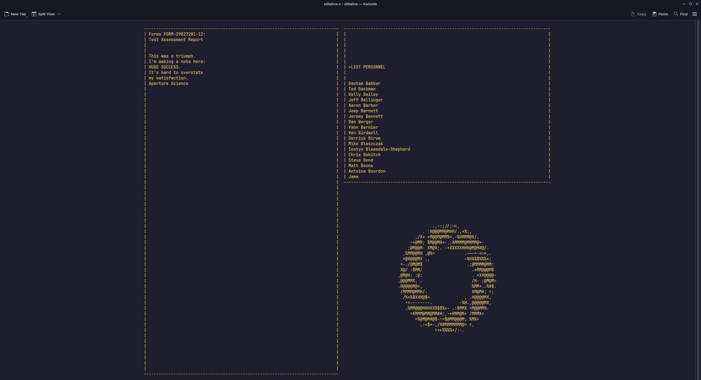

# stillalive c — русский перевод

> **Важно: это не мой код.**
>
> Оригинальный код принадлежит **Sidharth "Siddhi" Sharma** ([sidharthify](https://github.com/sidharthify)) —
> оригинальный репозиторий: **https://github.com/sidharthify/stillAlive-C**
>
> Я лишь выполнил **перевод текста на русский язык**. Вся логика, рендеринг, структура и
> оригинальная идея — заслуга автора оригинала. Этот репозиторий — просто русифицированная
> версия его работы.

<p align="center">
  
</p>

Воссоздание финальных титров Portal на чистом C.

Работает в обычных терминальных эмуляторах, воспроизводя эстетику терминала Aperture Science:
посимвольный набор текста, прокрутка титров и ASCII-графика, синхронизированные с треком.

* адаптивная вёрстка, которая динамически масштабируется под окно, сохраняя аутентичное
  соотношение сторон Portal 4:3
* аккуратная работа с терминалом: альтернативный экранный буфер и изменение размера без артефактов
* лёгкое воспроизведение звука с автоматическим перебором проигрывателей: pw-play, play, ffplay, mpv и aplay
* интерактивное управление: пауза, продолжение, перезапуск и переключение режимов масштабирования на лету

## благодарности и вдохновение

* оригинальная песня и игра Portal — Valve Corporation, автор песни — Jonathan Coulton, исполнение — Ellen McLain
* вдохновлено веб-версией still alive web от sd skykloud

## требования

* gcc или clang
* make
* **Linux / BSD / macOS**: любой установленный аудиопроигрыватель (pw-play, play, ffplay, mpv или aplay)
* **Windows**: Windows 10/11 с Windows Terminal, PowerShell или Command Prompt
  (звук воспроизводится нативно «из коробки» через Windows Multimedia)

аудиодорожки находятся в каталоге res/song.

## сборка

сборка через make:

```bash
make
```

очистка:

```bash
make clean
```

## использование

запуск бинарника напрямую:

```bash
./stillalive
```

или через make:

```bash
make run
```

### параметры

* `./stillalive autoplay` : пропускает загрузочный экран и запускается сразу
* `./stillalive silent` : запускает анимацию терминала без звука
* `./stillalive start=25000` : переход к определённому моменту в миллисекундах
* `./stillalive aspect` : вписывает окно терминала в аутентичные пропорции 4:3 (по умолчанию)
* `./stillalive fill` : растягивает блоки на весь размер окна
* `./stillalive classic` : использует фиксированный блок 98x38 символов

### управление

* `space` : пауза или продолжение
* `s` : переключение режима масштабирования между вписыванием, растяжением и фиксированным классическим
* `r` : перезапуск воспроизведения с начала
* `q` или `esc` : выход с восстановлением состояния терминала

## лицензия и права

Оригинальная песня и игра Portal принадлежат Valve Corporation.
Код оригинала — [sidharthify/stillAlive-C](https://github.com/sidharthify/stillAlive-C).
Перевод текста на русский язык — [PlazmoCraft](https://github.com/PlazmoCraft).
